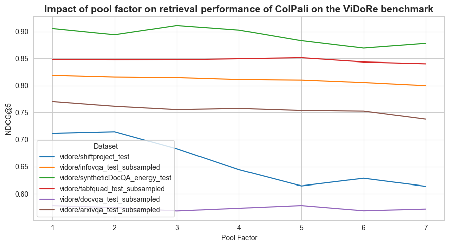
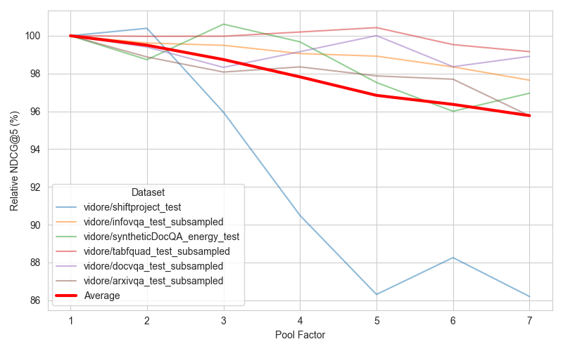
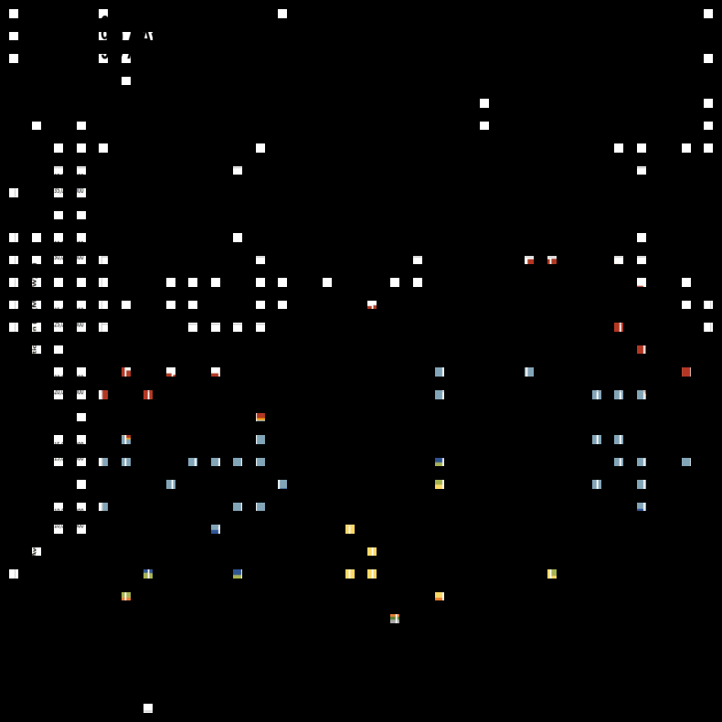

# Token Pooling: Impact of Pool Factor on Retrieval

**Author:** Tony Wu

**Creation date:** Tue, 6 Aug 2024 10:21:00 GMT+2

## Introduction

ColPali achieves strong retrieval performances on document retrieval tasks (see the ViDoRe benchmark).

However, your multi-vector embeddings scale linearly in size withe number of tokens! A direct consequence of having larger embeddings is longer indexing and search time. This is where indexing helps: we will approximate our embeddings to make everything go faster. To improve ColBERT, researchers have experimented with ColBERTv2  and Performance-optimized Late Interaction Driver (PLAID) and managed to use centroid and compression tricks to build a multi-step retrieval pipeline that is both efficient and accurate. While PLAID seems great on paper, because it’s centroid-based, it’s not tractable to create (C), update (U), nor to delete (D) a document from the vector store (or else, how would you update the centroids after each operation?). Hierarchical Navigable Small Worlds (HNSW) is fully CRUD but doesn’t scale well.

In his blog post [*"A little pooling goes a long way for multi-vector representations"*](https://www.answer.ai/posts/colbert-pooling.html) (2024), Benjamin Clavié proposes a simple but effective to a similar problem with ColBERT: to simply reduce the sequence length of the multi-vector embedding using pooling. Thus our problematic:

> Can we use token pooling to reduce the size of our embeddings and improve the retrieval performance and latency of ColPali?

We believe many image patches share redundant information, e.g. the background of a document. By pooling these patches, we can reduce the size of the embeddings while keeping the most important information. This will allow us to reduce the retrieval time and storage requirements of the model.

## Objectives

- (1) Investigate the impact of the pool factor on the retrieval performance and latency of the model.
- (2) Find the optimal pool factor for ColPali.
- (3) Interpretate the clustering of the embeddings.

## Assumption

For simplicity, we will only evaluate ColPali on 6 datasets out of the 10 available in the Vidore Benchmark. We will assume that the results will generalize to other datasets.

## Instructions

To run/reproduce the experiments, follow these steps:

1. Run the script `run.sh`. To run in the background, use the following command:

    ```bash
    mkdir -p logs/
    nohup ./experiments/2024-08-06_impact_of_pool_factor_on_retrieval/run.sh \
        > logs/2024-08-06_impact_of_pool_factor_on_retrieval.log 2>&1 &
    ```

2. Run the `./notebooks/plot_token_pooling_results.ipynb` notebook to visualize the results.
3. (Optional) Run the `./notebooks/plot_patches_per_cluster.ipynb` notebook to visualize an arbitrary cluster for a given document.

## Results

### Impact of Pool Factor on Retrieval Performance

**Evolution of absolute retrieval performance wrt to pool factor:**



**Evolution of relative retrieval performance wrt to pool factor:**



**Evolution of relative retrieval performance wrt to relative storage:**


**Comments:**

- As expected, the retrieval performance decreases with the pool factor *in general*.
- `vidore/shifproject_test` is a clear outlier here. As a reminder, the Shift dataset is a collection of environmental reports in French. It is the most text-dense corpus in ViDoRe. Thus, retrieval performance is mainly due to the OCR capabilities of the mode. We believe pooling merges important patches of text, hence loosing signal about the text semantics.
- The optimal pool factor is around 3: we reduced the total number of vectors by $1 - \frac{1}{3} \approx 66.7\%$ while keeping $\approx 97.8\%$ of the original retriever performance.

### Latencies

[See the `{{dataset_name}}_scoring_latencies.json` files for the raw data.]

We see no variance in latency with the pool factor. We believe this is due to the fact that we measure the latency of the model score computation once and with a small batch size. To confirm our assumption that having a shorter sequence length speeds up scoring, we should measure $N \gg 1$ times the latency of the scoring function with different sequence lengths.

### Interpretation of the clustering of the document embeddings

To facilitate visualization, we chose a high pool factor (100) to have more patches per cluster. The following image shows the patches in the most populated cluster.



There are no clear clusters in the document embeddings *a priori*.

## Conclusion

Pooling is a simple and effective way to reduce the size of the embeddings and improve the retrieval performance and latency of ColPali. We recommend using a pool factor of 3 to keep about 97% of the original retriever performance while compressing the embeddings by 75%.
